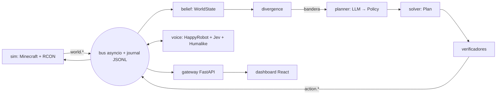

# Taiafox

[](https://www.youtube.com/watch?v=vYMx2elWio0)

**Taiafox es la entrega del Grupo Gamma para el track de HappyRobot de HackSpain 2026.**

Es un agente de crisis: recibe y emite llamadas telefónicas, decide qué hacer con un LLM y un
solver determinista, simula la emergencia en Minecraft y lo enseña todo en un dashboard en vivo.

## Qué problema resuelve

En una emergencia (un incendio forestal, un apagón) la información llega tarde, incompleta y por
canales distintos. Taiafox junta esos hechos, distingue lo que se ha **observado** de lo que solo
se **supone**, replantea el plan cuando la realidad se aleja de lo previsto y avisa a las personas
por teléfono.

Dos ideas de diseño lo sostienen:

- **El LLM nunca asigna recursos ni toca Minecraft.** Produce una política (pesos y restricciones);
  un solver (`scipy.optimize.linear_sum_assignment`) produce el plan; Minecraft solo pinta un
  estado que vive en nuestro modelo.
- **Un hecho asumido nunca se disfraza de observado.** Cada hecho lleva su tipo, y solo los
  observados fundan restricciones duras.

## Características

- Decisión con LLM + solver determinista, con verificadores en cadena.
- Simulación en Paper 1.21 por RCON (`/tp`, `/fill`, `/setblock`).
- Llamadas de entrada y de salida con HappyRobot, con percepción en llamada (TypeSafe Jev).
- Capa de Humalike encima de la voz (`foresee`, `analyze`, personas).
- Dashboard en tiempo real (Vite + React + TypeScript + Tailwind).
- Journal JSONL append-only: cualquier ejecución se puede reproducir.

## Arquitectura



Los paquetes solo se hablan por eventos; todos importan de `contracts`. Los contratos y eventos
están en [`docs/interfaces.md`](docs/interfaces.md) y el diseño vigente en
[`docs/backbon_corrected.md`](docs/backbon_corrected.md).

## Inicio rápido

Requisitos: Python 3.12 exacto, [`uv`](https://docs.astral.sh/uv/), `pnpm` y Java (para Paper).

```bash
git clone https://github.com/CarlosCaoLopez/HACKSPAIN-2026.git
cd HACKSPAIN-2026
cp .env.example .env      # rellena las claves que vayas a usar
make install              # uv sync + pnpm install del dashboard
make check                # mypy sobre contracts + pytest
```

## Ejemplos de uso

Cada pieza se puede arrancar sola con el resto simulado:

```bash
make dev-dash                          # dashboard con un journal de ejemplo
make dev-core                          # core aislado (también dev-sim y dev-voice)
make demo                              # todo de verdad, unos 6 minutos
make demo FLAGS="--mock-calls"         # plan B: sin llamadas reales
make demo FLAGS="--no-minecraft"       # plan B: sin Minecraft
make replay RUN=<id>                   # reproducir un journal
```

## Configuración

Todo vive en un único `.env` en la raíz (no se commitea; `.env.example` sí). Las variables están
comentadas una a una en [`.env.example`](.env.example). Sin clave de un servicio (Jev, Humalike,
HappyRobot) la pieza se degrada y lo anota en el journal en lugar de fallar en silencio.

## Compatibilidad

| Componente | Versión |
| --- | --- |
| Python | 3.12 (`fenic` declara `<3.13`) |
| Servidor de Minecraft | Paper 1.21 |
| Dashboard | Node con `pnpm`, Vite 6, React 19 |
| Sistemas | Windows 11 en desarrollo; Linux en el despliegue (VPS con Docker Compose) |

## Solución de problemas

- **`make demo` no conecta con el mundo**: comprueba que Paper está arrancado (`make server`) y que
  `RCON_HOST`, `RCON_PORT` y `RCON_PASSWORD` coinciden con `server.properties`.
- **El dashboard se conecta a un gateway viejo**: hay un uvicorn huérfano en el puerto 8000. Ejecuta
  `make levanta` para diagnosticarlo.
- **Las llamadas no salen**: falta la clave de HappyRobot o el túnel público. Usa
  `FLAGS="--mock-calls"` para seguir sin ellas.
- **El cliente de Minecraft dice «outdated server»**: `MC_VERSION` debe coincidir con el jar del
  servidor.

## Contribuir y soporte

Lee [CONTRIBUTING.md](CONTRIBUTING.md), el [código de conducta](CODE_OF_CONDUCT.md) y la
[gobernanza](GOVERNANCE.md). Para dudas o fallos, abre un issue en el repositorio.

## Licencia

Apache License 2.0. Consulta [LICENSE](LICENSE) y la justificación en
[docs/COMPONENTS_LICENSE.md](docs/COMPONENTS_LICENSE.md). El software se entrega **sin garantías**.
