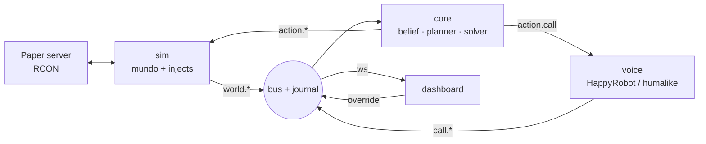

# Backbone técnico — Crisis Agent

**HackSpain 2026 · reto HappyRobot** · 2026-09-18

---

## Decisiones cerradas

**Backend en Python 3.12, frontend en TypeScript. Nada de Node en el servidor.** La razón que cierra el debate es Typedef: `fenic` es una librería Python y declara `Requires-Python: >=3.10, <3.13`, así que 3.12 es la versión exacta. Como ya habéis descartado los agentes LLM dentro de Minecraft, desaparece el único motivo que había para Node (mineflayer), y el control determinista del mundo se hace por RCON, que es trivial en cualquier lenguaje.

| Capa | Elección | Por qué |
| --- | --- | --- |
| Lenguaje backend | Python 3.12 | `fenic` no soporta 3.13; Pydantic para contratos tipados |
| Contratos | Pydantic v2 | Los mismos modelos sirven de esquema para `semantic.extract` |
| HTTP + WebSocket | FastAPI + uvicorn | Un solo proceso sirve API, webhooks y el WS del dashboard |
| Bus de eventos | asyncio in-process + journal JSONL | Cero infra que se caiga en el escenario; replay gratis |
| Contexto y extracción | Typedef `fenic` | `semantic.extract` con esquema Pydantic, `semantic.classify`, batch e inferencia fuera del prompt del agente |
| Razonamiento | Modelo frontera de razonamiento vía API | Genera política y prioridades, nunca la asignación final |
| Asignación | `scipy.optimize.linear_sum_assignment` | Determinista, instantánea, explicable |
| Mundo | Paper 1.21 + RCON (`mcrcon`) | `/tp`, `/fill`, `/setblock`. Sin pathfinding, sin bots |
| Telefonía | HappyRobot | Requisito del reto e integración por webhook + humalike por encima para hacerlo mas humano |
| Dashboard | Vite + React + TypeScript + Tailwind | Único sitio donde hay TS |
| Gestión de deps | `uv` (Python) + `pnpm` (dashboard) | Instalación en segundos, lockfile reproducible |
HappyRobot es la infraestructura de voz y ejecución agéntica:
Es el motor de telefonía y acciones. Se encarga de levantar llamadas telefónicas reales a redes celulares (SIP/PSTN), procesar el audio bidireccional con baja latencia, conectar herramientas (APIs, dispatchers, bases de datos) y ejecutar flujos de trabajo.

### Las tres reglas que no se rompen

1. **El LLM nunca toca Minecraft.** Minecraft es un renderizador de un estado que vive en nuestro modelo. El mismo Core funciona con datos reales cambiando el adaptador.
2. **El LLM nunca asigna recursos.** Decide qué importa; un solver decide quién va dónde. Esto es lo que hace el sistema reproducible y auditable, y es la respuesta a la pregunta de responsabilidad que os van a hacer.
3. **Todo evento se escribe al journal antes de ejecutarse.** Sin journal no hay replay, y sin replay no hay bonus de aprendizaje.

### Nombre de trabajo

`vela` — una vela encendida en una crisis, y VELA como acrónimo de Ver, Establecer prioridad, Llamar, Adaptar. Cambiadlo si se os ocurre algo mejor, pero fijadlo antes de escribir el primer import.

---

## El escenario, minuto a minuto

**La demo dura 6 minutos y tiene un solo clímax: una llamada real cuelga y las unidades giran en pantalla en menos de 3 segundos.** Todo lo demás existe para preparar ese momento.

### Cómo se crea el mundo

El mundo no se genera, se declara. `scenarios/wildfire_ridge.yaml` es la única fuente de verdad y contiene cinco bloques: `pois` (pueblo A, pueblo B, hospital, refugio, base), `units` (2 camiones, 1 ambulancia, 1 dron), `roads` (grafo de waypoints con coordenadas, capacidad y flag `cut`), `civilians` (20 aldeanos con posición y flag de movilidad) y `injects` (la línea temporal de sorpresas).

Al arrancar, `sim/worldgen.py` abre RCON contra un servidor Paper local y ejecuta una secuencia fija:

1. `/gamerule doFireTick false` y `/gamerule randomTickSpeed 0` — el fuego lo movemos nosotros, nunca Minecraft. Un bloque `fire` colocado se queda quieto donde lo pongas.
2. `/time set 6000`, `/weather clear`, `/gamerule doDaylightCycle false` — iluminación constante para que la grabación sea igual en el ensayo y en el escenario.
3. Por cada aldeano: `/summon villager X Y Z {NoAI:1b,CustomName:...,Tags:["civ","civ_A_07"]}`. `NoAI:1` es lo que impide que deambulen; son extras, no actores.
4. Por cada unidad: `/summon armor_stand` con `Tags:["unit","unit_truck1"]`, `ShowArms:1`, y una cabeza de bloque distinta por rol para que se distingan a 10 metros.
5. Marcadores de POI con `/summon block_display` y un bloque de color por tipo.

Ese arranque tarda unos 4 segundos y es idempotente: `/kill @e[tag=vela]` y vuelve a lanzarse. Lo vais a ejecutar 200 veces este fin de semana.

### Qué está pasando realmente

El aldeano **no se mueve hacia el incendio**. Los aldeanos son estáticos y representan población expuesta. Lo que se mueve son las unidades, y se mueven porque el Core lo ordena.

Un `goto(unit_id, waypoint_id)` no dispara pathfinding. El sim resuelve la ruta sobre el grafo de carreteras del YAML con un Dijkstra de 20 líneas, obtiene una polilínea de waypoints e interpola: cinco veces por segundo emite `/tp @e[tag=unit_truck1] x y z <yaw> 0`. El armor stand se desliza por la carretera de forma perfectamente determinista y emite `unit.arrived` al llegar. Si una arista está marcada `cut`, Dijkstra simplemente no la usa, y ahí está toda la magia del replan.

El incendio es un autómata celular sobre una rejilla de 4×4 bloques. Cada tick de simulación (1 s), una celda con fuego intenta propagarse a sus vecinas con probabilidad proporcional al coseno del ángulo respecto al vector viento. Renderizar = `/fill` de `netherrack` + `fire` encima, más `/particle campfire_cosy_smoke` para la columna de humo. Cambiar el viento es cambiar un vector en memoria.

### La línea temporal

| T | Qué pasa en el mundo | Qué hace el sistema | Qué se ve en pantalla |
| --- | --- | --- | --- |
| 00:00 | Ignición en la cresta oeste | `world.fire.detected` entra al Core | Humo en Minecraft, primera fila en el feed |
| 00:15 | Fuego avanza con viento O→E | Planner emite política: civiles a sotavento antes que estructuras | Cola de prioridades con su justificación |
| 00:25 | — | Solver asigna: camión 1 al frente, camión 2 a retén, ambulancia al hospital | Tres flechas de asignación en el mapa |
| 00:30 | Camiones arrancan | RCON interpola por la carretera | Unidades moviéndose |
| 01:00 | — | Llamamos al agente (HappyRobot); en la misma llamada nos dicta la orden de evacuación del pueblo A | Tarjeta de llamada en curso, con el audio en directo |
| 01:45 | — | Confirmamos la orden y colgamos | Tarjeta pasa a *completada* |
| 02:30 | **Inject 1: el viento gira 90°** | Detector de divergencia dispara | Banner rojo REPLAN con el motivo |
| 02:35 | Unidades dan media vuelta | Nueva política, nueva asignación | Flechas cambian de destino |
| 03:30 | **Inject 2: llamada entrante** | Un vecino (humalike) llama asustado desde el pueblo B | Transcripción en vivo en el panel |
| 04:10 | La llamada cuelga | `semantic.extract` saca los hechos, se asertan, el verificador falla, replan | REPLAN + las unidades giran |
| 05:00 | Pueblo B evacuado por la ruta sur | Marcador de objetivo cumplido | Métricas finales |

### El momento de la llamada, en detalle

El vecino llama y dice algo como: *"estoy en el molino viejo, la pista del sur está cortada por un árbol y hay tres personas en la casa de al lado que no pueden andar"*.

1. **Durante la llamada** no pasa nada en el mundo. humalike conversa; nosotros solo guardamos audio y transcripción parcial. Resistid la tentación de actuar en streaming: añade latencia y modos de fallo, y en escenario no se aprecia.
2. **Al colgar**, humalike dispara su webhook a `POST /webhooks/humalike/call-ended` con la transcripción completa.
3. El `voice` package la mete en un DataFrame de `fenic` de una fila y aplica `semantic.extract(CallFacts)`, donde `CallFacts` es un modelo Pydantic con campos `location_hint`, `road_blocked`, `people_immobile`, `confidence`. Esto tarda entre 1 y 2 segundos y devuelve tipos, no texto.
4. Cada campo no nulo se publica como un evento `world.fact.asserted` con su procedencia (`source: call:hl_8821`). El Core marca la arista `wp_sur_03 → wp_sur_04` como `cut` y crea una tarea `rescue` con 3 personas inmóviles en el molino.
5. El **detector de divergencia** compara el mundo que el plan vigente daba por supuesto contra el mundo actual. La ruta de evacuación asignada ya no es transitable, así que la divergencia supera el umbral y además el verificador de rutas devuelve infactible. Se interrumpe el plan.
6. El planner recibe el estado nuevo y el motivo de la interrupción, emite política actualizada, el solver reasigna en 40 ms y el sim recibe nuevos `goto`.
7. **En pantalla**: banner REPLAN con el texto *"pista sur cortada, confirmado por llamada entrante"*, las flechas cambian, y en Minecraft los dos camiones frenan y toman el desvío norte.

Presupuesto de latencia de colgado a giro: 1,5 s de extracción + 0,3 s de planner cacheado + 0,04 s de solver + 0,2 s de RCON. Por debajo de 3 segundos, que es lo que aguanta un jurado sin apartar la vista.

### Quién hace de quién

**Vosotros hacéis de ciudadano preocupado** cuando llamáis al agente para darle información del terreno, y **hacéis de responsable de intervención** cuando llamáis al agente y él, como coordinador de emergencias, os dicta en esa misma llamada la orden de evacuación que ha decidido el Core. Las dos se ven en la misma demo y son dos productos distintos: recibir el pico de información y ejecutar la respuesta.

---

## Arquitectura del sistema

**Cuatro paquetes que solo se hablan por eventos tipados, corriendo en un único proceso FastAPI.** Un proceso no es pereza: cada servicio separado es un modo de fallo más en un escenario con wifi de hackathon. Las fronteras entre paquetes son reales (nadie importa del paquete de otro), pero el despliegue es un `uv run vela`.



### El bus y el journal

Un `asyncio.Queue` por suscriptor y una función `publish(event)` que hace dos cosas en este orden: escribe la línea en `runs/<run_id>.jsonl` y luego reparte. El orden importa: si algo revienta a mitad de demo, el journal ya tiene el evento y podéis hacer replay.

Todo evento lleva `run_id`, `seq` monotónico, `t_sim`, `type`, `source` y `payload`. Con eso, el journal es a la vez log, base de datos y dataset de entrenamiento para el bonus de aprendizaje.

### El ciclo de vida de un tick

1. `sim` avanza 1 segundo simulado: propaga fuego, interpola posiciones, dispara injects vencidos. Publica `world.*`.
2. `core.belief` aplica los eventos sobre el `WorldState` (un modelo Pydantic inmutable, se reemplaza entero cada tick).
3. `core.divergence` compara el `WorldState` actual contra `PlanContext.assumptions`, las suposiciones que el plan vigente daba por buenas. Devuelve un escalar y una lista de suposiciones rotas.
4. Si la divergencia supera el umbral, o un verificador marca el plan infactible, o entra un hecho de prioridad alta, se levanta la bandera de replan. **Si no, no se llama al modelo.** Esto es lo que mantiene el coste y la latencia bajo control.
5. En replan: `planner` produce una `Policy`, `solver` produce un `Plan`, `verifiers` lo validan. Si falla, vuelve al planner con la crítica, máximo dos vueltas, y si sigue fallando se cae al plan degradado del solver sin pesos.
6. `core` publica `action.*`. `sim` y `voice` las ejecutan y confirman con `action.completed` o `action.failed`.

### Por qué esta arquitectura y no un grafo de agentes

La tentación es montar seis agentes LLM que se hablan entre ellos. No lo hagáis. En una demo de 6 minutos, cada salto entre agentes es medio segundo de latencia y una oportunidad de alucinar, y no podéis explicar en el pitch por qué el sistema hizo lo que hizo.

Aquí hay exactamente **una** llamada al modelo de razonamiento por replan, y produce un objeto pequeño y tipado. El resto es código determinista. Eso significa que podéis pausar, hacer replay y enseñar la traza completa de cualquier decisión, que es literalmente el criterio *Control* de la evaluación.

---

## El motor de decisión

**El modelo decide qué importa; un solver decide quién va dónde.** Esta frase es vuestra diferenciación técnica y la respuesta a la pregunta de responsabilidad.

### El estado del arte que estáis aplicando

El trabajo de referencia es el de Kambhampati et al., que argumenta que los LLM autorregresivos no pueden por sí solos planificar ni autoverificarse, y propone el marco **LLM-Modulo**: el LLM como generador aproximado de ideas, combinado con verificadores externos basados en modelo en un bucle bidireccional, en lugar de encadenar simplemente LLM y componentes simbólicos ([ICML 2024](https://proceedings.mlr.press/v235/kambhampati24a.html)). El mismo trabajo desmonta el mito de la autocrítica: iterar con el LLM como su propio crítico llega a degradar el rendimiento, y los verificadores LLM producen muchos falsos positivos frente a verificadores externos correctos.

Aplicado a vuestro caso, un incendio es un problema de asignación con restricciones duras. Un LLM suelto asignará tres camiones al mismo frente y os dejará el hospital sin cobertura, y lo hará con una explicación preciosa. El solver nunca lo hará.

La segunda pieza es Typedef. `fenic` se describe como una capa de construcción de contexto que funciona con cualquier framework de agentes: declaras qué debe ver el agente, lo construyes con transformaciones deterministas y semánticas, y expones el resultado como herramientas tipadas y acotadas, descargando la inferencia fuera de la ventana de contexto del agente ([repo](https://github.com/typedef-ai/fenic)). Ofrece `semantic.extract` para extracción estructurada con modelos Pydantic, `semantic.classify` para clasificación sin datos de entrenamiento, y `semantic.join` para casar texto sucio contra datos limpios.

### Los cinco niveles

| Nivel | Qué hace | Con qué | Determinista |
| --- | --- | --- | --- |
| 0 · Estado | `WorldState` tipado: unidades, celdas, rutas, tareas, civiles | Pydantic | Sí |
| 1 · Ingesta | Texto sucio a hechos tipados con procedencia y confianza | `fenic.semantic.extract` / `classify` | No, pero acotado por esquema |
| 2 · Política | Pesos de objetivo y restricciones duras para esta situación | OpenAI GPT-5.6 Luna (tier rápido, cabe en el presupuesto de 4 s) | No |
| 3 · Asignación | Recursos a tareas minimizando coste | `linear_sum_assignment` | Sí |
| 4 · Verificación | Rechaza planes infactibles y los devuelve con la crítica | Código puro | Sí |

### Qué devuelve exactamente el modelo

No devuelve acciones. Devuelve una `Policy`, y es un objeto pequeño:

```python
Policy(
  rationale: str,                     # una frase, va al banner del dashboard
  weights: {life_safety: 1.0,         # pesos del objetivo
            immobile_first: 0.8,
            structure_protection: 0.3,
            containment: 0.5},
  hard_constraints: ["no_unit_into_burning_cell",
                     "hospital_min_coverage:1",
                     "no_civilian_route_through:wp_sur_03"],
  horizon_s: 600,
  escalate_to_human: false
)
```

El solver construye una matriz de coste unidad × tarea usando esos pesos más la distancia real sobre el grafo, y `scipy.optimize.linear_sum_assignment` resuelve el emparejamiento óptimo en microsegundos. Las restricciones duras se aplican poniendo coste infinito en las celdas prohibidas, así que el solver no puede violarlas ni queriendo.

### Los verificadores

Cuatro funciones puras, cada una devuelve `None` o un `Violation` con texto legible:

- `route_feasible` — toda ruta asignada existe en el grafo y no cruza aristas `cut` ni celdas en llamas.
- `coverage_maintained` — ningún POI crítico se queda por debajo de su cobertura mínima.
- `no_double_booking` — ninguna unidad en dos tareas.
- `civilian_reachable` — cada grupo de civiles tiene al menos una ruta viva al refugio asignado.

Si alguna falla, el `Violation` vuelve al planner como crítica textual. Dos intentos. A la tercera se cae al plan del solver con pesos neutros, que siempre es factible aunque sea subóptimo. **La demo nunca se queda sin plan.**

### El detector de divergencia

Es la pieza que puntúa en *Adaptación* y la que casi nadie implementa bien. Cuando se emite un plan, se guarda junto a él un `PlanContext.assumptions`: la lista de hechos que el plan da por ciertos (esta ruta es transitable, esta celda no arde, esta unidad está disponible, hay 12 civiles en el pueblo A).

Cada tick se reevalúan esas suposiciones contra el estado real. `divergence = suposiciones_rotas_ponderadas / total_ponderado`. Por encima de 0,25, replan. Además hay dos disparadores inmediatos: violación de restricción dura, y llegada de un hecho con `severity: critical`.

El valor de divergencia va en el dashboard como una línea que sube y cruza el umbral justo antes del banner rojo.

### El aprendizaje entre ejecuciones (el bonus)

Al terminar un run, un job batch carga todos los journals anteriores en `fenic` y extrae, con `semantic.extract` sobre un esquema `LearnedRule`, patrones del tipo *"cuando el viento gira más de 60°, evacuar antes de reasignar extinción"*. Las reglas con soporte en al menos dos runs se escriben en `memory/policy_rules.md`, que se inyecta en el prompt del planner del run siguiente.

Enseñad **run 1 contra run 12 en pantalla partida con la puntuación de cada uno**. Es un criterio explícito de puntos extra y casi ningún equipo lo va a tener funcionando.

---

## La capa de simulación

**Sin mineflayer, sin cuentas de Minecraft, sin IA dentro del juego. Solo RCON y comandos.** El servidor Paper es un dispositivo de salida, como una pantalla.

### Montaje del servidor

Paper 1.21 en local, nunca en la nube. En `server.properties`: `online-mode=false`, `enable-rcon=true`, `rcon.port=25575`, `view-distance=8`, `simulation-distance=4`, `spawn-protection=0`.

El mapa se construye a mano una vez, se guarda en `infra/server/world/` y se commitea. Un valle, dos pueblos separados por una cresta, un hospital, un refugio y una carretera en Y con un desvío norte y otro sur. Media hora de creativo bien invertida: un mapa legible desde arriba vale más que cualquier optimización.

### El API de la simulación

| Comando | Qué hace | Cómo se implementa |
| --- | --- | --- |
| `goto(unit_id, waypoint_id)` | Mueve una unidad por carretera | Dijkstra sobre el grafo, interpolación a 5 Hz con `/tp` |
| `set_marker(poi_id, state)` | Cambia el color de un POI | `/setblock` de concreto por color |
| `announce(text, area)` | Aviso visible en el mundo | `/title` + `/playsound` a los jugadores de la zona |
| `rescue(civ_ids, shelter_id)` | Marca civiles como a salvo | `/tp` al refugio + `/effect give glowing` |

Cada uno publica `action.completed` cuando termina. `goto` publica además `unit.position` cada segundo, que es lo que alimenta el mapa del dashboard.

### El autómata del peligro

Una clase `Hazard` con tres implementaciones que comparten interfaz: `Wildfire`, `Flood`, `Blackout`. Todas exponen `tick(dt) -> list[CellChange]` y `cells_at_risk(horizon_s)`.

`Wildfire` es una rejilla de celdas de 4×4 bloques con estados `intact / at_risk / burning / burnt`. Cada tick, una celda `burning` intenta propagarse a cada vecina con probabilidad `base * (1 + cos(ángulo entre viento y dirección)) * fuel`. La semilla del RNG va en el YAML, así que **el mismo escenario produce el mismo incendio en cada ensayo**.

Renderizado: una celda que pasa a `burning` lanza `/fill x1 y z1 x2 y z2 netherrack` y `/fill x1 y+1 z1 x2 y+1 z2 fire`, más una partícula de humo. Con `doFireTick false` ese fuego no se propaga solo ni quema nada. Una celda `burnt` se convierte en `coal_block`, lo que deja una cicatriz negra vista desde arriba.

### Los injects

```yaml
injects:
  - at: 150
    type: wind_shift
    payload: {bearing: 90, speed: 1.4}
  - at: 210
    type: road_cut
    payload: {edge: wp_norte_02-wp_norte_03, cause: "árbol caído"}
  - at: 240
    type: unit_failure
    payload: {unit: truck2, reason: "avería de bomba"}
```

Y uno más que no está en el YAML porque lo dispara la llamada entrante. Ese es el importante.

Añadid un endpoint `POST /sim/inject` para lanzar cualquiera a mano desde el dashboard. En el ensayo lo vais a usar constantemente, y en el pitch os da un botón de emergencia si algo se retrasa.

### Cámara y grabación

Un cliente real en modo espectador, en una segunda pantalla, capturado por OBS. Nada de `prismarine-viewer`: añade una dependencia de Node que ya no necesitáis y se ve peor.

Posiciones de cámara preconfiguradas con `/tp @s x y z yaw pitch` guardadas en un macro: vista cenital del valle, plano del pueblo A, plano del frente.

---

## La capa de telefonía


### HappyRobot: el agente dicta la orden

**Nosotros llamamos al agente y él, en esa misma llamada, nos dicta la orden que ha decidido el Core.** No hay llamada saliente a un tercero: la voz saliente es el agente locutando la orden dentro de la llamada que colocamos nosotros.

La plataforma está organizada en workflows: cada workflow empieza por un trigger y sigue con acciones ejecutadas secuencialmente, y el trigger de tipo *incoming hook* permite enviar una petición a una URL propia para arrancar el workflow, sin esquema predefinido, de forma que el cuerpo que enviáis define las variables disponibles para las acciones siguientes ([docs](https://docs.happyrobot.ai/integrations/webhook)). Recomiendan POST y añadir la cabecera `Content-Type: application/json`.

| Workflow | Trigger | Acción | Uso en la demo |
| --- | --- | --- | --- |
| `evacuation_order` | incoming hook | El agente locuta la orden de evacuación en la llamada | Minuto 1:00: le llamamos y nos dicta la evacuación |
| `resource_request` | incoming hook | El agente dicta la petición de medios | Tras el replan, opcional |
| `status_broadcast` | incoming hook | SMS masivo | Prueba de multicanal |

El Core publica la orden con los mismos campos —`run_id`, `task_id`, `poi_name`, `route_name`, `deadline_min`, `severity`— vía POST al incoming hook, y el agente los locuta cuando entra la llamada.

Para el retorno, el asistente se configura con un webhook que se dispara en los eventos de inicio, fin y fallo de llamada, con una carga cuya estructura incluye `type` (`start` o `end`), `call.id`, y un `call.metadata.custom` de tipo libre ([docs](https://docs.happyrobot.ai/details/phone_calling)). **Meted vuestro `task_id` en `metadata.custom`**: es lo que os permite casar la llamada con la tarea sin mantener estado en la plataforma.

### humalike: el ciudadano llama

Humalike es la infraestructura de comportamiento e inteligencia social:
Es una capa middleware de behavioral infrastructure. No se encarga del transporte telefónico ni de la lógica de negocio; se enfoca en cómo se comunica el agente: turn-taking (saber cuándo interrumpir o cuándo callar), detección de tono emocional, ritmo adaptativo y gestión de la conversación en tiempo real.(https://docs.humalike.com/)

1. **El vecino del minuto 3:30.** Uno de vosotros llama La conversación es natural, desordenada, con información parcial y contradictoria. Eso es exactamente lo que el enunciado describe cuando dice que llegan cien mensajes y solo tres cambian algo.
2. **Veinte llamadas simultáneas.** Lanzad un lote de llamadas entrantes sintéticas mientras la demo corre. El dashboard muestra 20 conversaciones y el sistema descarta 17. Ese contraste es la demostración visual de *Qué información importa*.

### De la transcripción al hecho

```python
class CallFacts(BaseModel):
    location_hint: str | None      # "el molino viejo"
    road_blocked: str | None       # identificador o descripción
    people_immobile: int | None
    injuries: int | None
    contradicts_known: bool
    urgency: Literal["low","medium","critical"]

df = session.create_dataframe([{"transcript": text}])
facts = df.select(
    fc.semantic.extract(fc.col("transcript"), CallFacts).alias("f")
).to_pylist()
```

La resolución de `location_hint` contra un POI real del escenario se hace con `semantic.join` contra la tabla de POIs. Cada campo no nulo sale como `world.fact.asserted` con `source`, `confidence` y `call_id`: **ningún hecho aparece en pantalla sin decir de qué llamada viene**.

### Números de teléfono y ensayo

Comprad los números el viernes por la noche. Uno para el agente (al que llamamos), uno para la entrante del vecino, uno de repuesto. Probad la llamada al agente el sábado por la tarde: la cobertura de una sala con 200 personas es el punto de fallo más tonto y más probable de todo el proyecto.

Plan B: el script de demo tiene un modo `--mock-calls` que reproduce un audio grabado y publica los mismos eventos.

---

## Estructura de carpetas

**Un paquete por persona, y `contracts/` que no es de nadie.** Si dos personas tocan el mismo fichero, algo se ha diseñado mal.

```
vela/
├─ pyproject.toml              # workspace uv, python = "3.12.*"
├─ Makefile                    # make dev, make demo, make world, make replay
├─ .env.example
├─ packages/
│  ├─ contracts/               # NADIE es dueño · se cambia con los 4 mirando
│  │  └─ src/contracts/
│  │     ├─ events.py          # Event, EventType, envelope
│  │     ├─ world.py           # WorldState, Unit, Cell, Road, Task, Civilian, POI
│  │     ├─ plan.py            # Policy, Plan, Assignment, Violation, PlanContext
│  │     ├─ calls.py           # CallRequest, CallResult, CallFacts
│  │     ├─ factkeys.py        # claves de hecho y sus tipos
│  │     └─ bus.py             # publish / subscribe / journal
│  ├─ sim/                     # Luis
│  │  └─ src/sim/
│  │     ├─ rcon.py            # cliente, cola, reintentos
│  │     ├─ worldgen.py        # arranque idempotente del mundo
│  │     ├─ graph.py           # carreteras, Dijkstra
│  │     ├─ movement.py        # interpolador 5 Hz
│  │     ├─ hazard.py          # Wildfire | Flood | Blackout
│  │     ├─ injects.py
│  │     ├─ scenario.py        # loader del YAML
│  │     └─ runner.py          # el tick loop
│  ├─ core/                    # Carlos · belief/ingest de Hugo
│  │  └─ src/core/
│  │     ├─ belief.py          # eventos → WorldState
│  │     ├─ ingest.py          # fenic: extract, classify, join
│  │     ├─ planner.py         # WorldState → Policy
│  │     ├─ solver.py          # Policy → Plan
│  │     ├─ verifiers.py       # Plan → list[Violation]
│  │     ├─ divergence.py
│  │     ├─ memory.py          # reglas aprendidas entre runs
│  │     ├─ prompts/
│  │     └─ loop.py
│  ├─ voice/                   # Hugo entrante · Carlos saliente
│  │  └─ src/voice/
│  │     ├─ happyrobot.py      # disparar workflows
│  │     ├─ humalike.py       # entrantes
│  │     ├─ webhooks.py        # routers FastAPI
│  │     ├─ fake.py            # mock para trabajar en paralelo
│  │     └─ synthetic.py       # generador de ruido de llamadas
│  └─ journal/
│     └─ src/journal/
│        ├─ writer.py
│        ├─ replay.py
│        └─ score.py           # métricas de un run
├─ apps/
│  ├─ gateway/                 # Nacho backend · FastAPI, monta todo
│  │  └─ src/gateway/
│  │     ├─ main.py
│  │     ├─ ws.py              # el canal al dashboard
│  │     └─ control.py         # pausa, override, inject manual
│  └─ dashboard/               # Nacho · Vite + React + TS + Tailwind
│     └─ src/
│        ├─ App.tsx
│        ├─ types.ts           # GENERADO desde contracts, no a mano
│        ├─ hooks/useEventStream.ts
│        └─ panels/
│           ├─ MapPanel.tsx
│           ├─ WhatChangedPanel.tsx
│           ├─ PriorityQueue.tsx
│           ├─ ActionLog.tsx
│           ├─ CallsPanel.tsx
│           └─ DivergenceChart.tsx
├─ scenarios/
│  ├─ wildfire_ridge.yaml
│  └─ blackout_grid.yaml
├─ fixtures/                   # journals de ejemplo para trabajar sin los demás
│  ├─ run_golden.jsonl
│  └─ transcripts/
├─ runs/                       # salida, gitignored salvo los buenos
├─ memory/
│  └─ policy_rules.md
├─ scripts/
│  ├─ demo.py                  # el guion de la demo, con --mock-calls
│  └─ gen_ts_types.py          # Pydantic → TypeScript
└─ infra/
   ├─ docker-compose.yml
   └─ server/                  # Paper, server.properties, world/
```

### Tres detalles que evitan dolor

1. **`types.ts` se genera**, nunca se escribe. `scripts/gen_ts_types.py` recorre los modelos de `contracts` y emite interfaces TypeScript. Un `make types` antes de cada push del dashboard.
2. **`fixtures/run_golden.jsonl`** es un run completo grabado el sábado por la mañana. A partir de ese momento cualquiera puede trabajar sin el resto del sistema.
3. **`runs/` gitignored salvo lo bueno.** Cuando un run sale bien, se commitea. Son vuestro dataset y la prueba de que el aprendizaje funciona.

---

## Reparto de trabajo

Dos parejas, dos dominios. **Hugo y Carlos** llevan la parte agéntica (percepción → decisión →
voz); **Luis y Nacho** llevan la simulación y su cara (mundo → gateway → dashboard). Dentro de cada
pareja el trabajo se subdivide por fichero para no romper la regla de *un fichero, un dueño*.

### Las dos parejas

| Pareja | Dominio | Paquetes | El corte |
| --- | --- | --- | --- |
| **Hugo + Carlos** | Agéntico | `packages/core`, `packages/journal`, `packages/voice` | Hugo la oreja (lo que entra y se hace estado), Carlos el cerebro y la boca (lo que decide y sale) |
| **Luis + Nacho** | Simulación + cara | `packages/sim`, `infra`, `scenarios`, `apps/gateway`, `apps/dashboard`, `scripts` | Luis el mundo (Minecraft, física, injects, cámara), Nacho la cara (gateway, WS, dashboard, demo) |

### Dueño por fichero

| Persona | Ficheros | Cadena | También le toca |
| --- | --- | --- | --- |
| **Hugo** · percepción + voz entrante | `voice/humalike.py`, `voice/webhooks.py`, `voice/synthetic.py`, `voice/fake.py`, `core/ingest.py`, `core/belief.py` | Llamada entra → transcripción → `semantic.extract` → hechos → `WorldState` | Hacer de vecino en la llamada (humalike entrante) |
| **Carlos** · decisión + voz saliente | `core/planner.py`, `core/solver.py`, `core/verifiers.py`, `core/divergence.py`, `core/memory.py`, `core/loop.py`, `core/prompts/`, `journal/**`, `voice/happyrobot.py` | `WorldState` → divergencia → `Policy` → `Plan` → verificación → `action.*` → el agente locuta la orden | Explicar el motor de decisión al jurado |
| **Luis** · mundo | `sim/**` (`rcon`, `worldgen`, `graph`, `movement`, `hazard`, `injects`, `scenario`, `runner`), `infra/**`, `scenarios/*.yaml` | Estado del modelo → RCON → mundo renderizado + injects | Mover la cámara durante la demo |
| **Nacho** · cara | `apps/gateway/**` (`main`, `ws`, `control`), `apps/dashboard/**`, `scripts/demo.py`, `scripts/gen_ts_types.py` | Bus → WS → paneles del dashboard | Narrar el pitch y montar la landing |

`contracts/**` no es de nadie: se toca solo en la ventana de contrato con los cuatro mirando.
`fixtures/**` es de quien lo genera. `voice/webhooks.py` es de Hugo aunque enrute también el
callback saliente de HappyRobot: si Carlos necesita tocar una ruta, se la pide.

**Correspondencia con los roles P1–P4 del resto de docs y de `CLAUDE.md`:** P1 Cerebro = Carlos
(con `belief`/`ingest` de Hugo) · P2 Mundo = Luis · P3 Voz = Hugo (entrante) + Carlos (saliente) ·
P4 Cara = Nacho. La pareja agéntica es P1+P3; la de simulación, P2+P4.

### Cronograma

| Bloque | Hugo · percepción + voz-in | Carlos · decisión + voz-out | Luis · mundo | Nacho · cara |
| --- | --- | --- | --- | --- |
| Vie 18–20 | **Los cuatro: cerrar `contracts/` y el guion de la demo en una pizarra. Nada de código hasta que esté.** | | | |
| Vie 20–00 | `belief.py` + `WorldState` sobre eventos falsos · comprar número entrante | Cuentas + número del agente, primera llamada de prueba (HappyRobot) | Paper arriba, RCON respondiendo, mapa a mano | Gateway + WS + esqueleto de paneles |
| Sáb 00–02 | `ingest.py` (fenic `extract`) sobre una transcripción de ejemplo | `solver.py` con pesos fijos, sin LLM · workflow `evacuation_order` por curl | `goto` moviendo un armor stand | Mapa pintando posiciones del mock |
| Sáb 09–13 | `humalike.py` + `webhooks` entrante conectados al bus | `planner.py` + prompts + `verifiers.py` · webhook de fin de llamada al bus | Autómata de fuego renderizando | Panel *qué ha cambiado* + cola de prioridad |
| Sáb 13–14 | **Integración 1: el sistema decide y mueve unidades de punta a punta. Grabar `run_golden.jsonl`.** | | | |
| Sáb 14–18 | humalike entrante real → `semantic.extract` a hechos → `belief` | `divergence.py` + bucle de replan | Injects: viento, corte, avería | Banner REPLAN, log de acciones, panel de llamadas |
| Sáb 18–20 | **Integración 2: ensayo completo con llamada real. Cronometrar colgar → giro.** | | | |
| Sáb 20–00 | `synthetic.py`: llamadas sintéticas en lote | `memory.py`: reglas entre runs | Segundo escenario, `blackout_grid` | Gráfica de divergencia + métricas finales |
| Dom 00–02 | Plan B `--mock-calls` (`fake.py`) probado · ayuda a los 12 runs | Correr 12 runs seguidos para el run 1 vs run 12 | Posiciones de cámara y macros | Landing con los números del pitch |
| Dom 09–11 | **Congelación de código.** Solo se arreglan cosas rotas. | | | |
| Dom 11–13 | Ensayo, ensayo, ensayo. Mínimo seis pasadas completas con reloj. | | | |

### La regla de las 13:00 del sábado

Si a las 13:00 del sábado no tenéis el sistema decidiendo y moviendo unidades de punta a punta, aunque sea con pesos fijos y sin LLM, **recortad**: fuera el segundo escenario, fuera las llamadas sintéticas, fuera la memoria entre runs. El orden de sacrificio es exactamente ese.

Lo que no se sacrifica nunca: una llamada real que cuelga y cambia el plan, y el dashboard donde se entiende por qué.

### Coordinación

Un canal, tres mensajes fijos al día: a las 13:00, a las 20:00 y a las 02:00, cada uno dice en una línea qué ha terminado y qué le bloquea. Nada de reuniones. Los merges a `main` van directos, sin PR, pero con `make check` verde.

---

## Riesgos y plan B

**El riesgo real no es técnico, es que el jurado piense que Minecraft es un juguete.**

| Riesgo | Probabilidad | Mitigación |
| --- | --- | --- |
| El jurado lee Minecraft como juguete | Alta | Reencuadre en los primeros 20 segundos: *no es la demo, es el banco de pruebas*. Enseñar el dashboard antes que el mundo |
| La llamada no entra por cobertura | Media | Número probado el sábado + `--mock-calls` con audio grabado |
| El servidor Paper se arrastra en escenario | Media | Local, `view-distance=8`, máximo 6 entidades móviles, portátil enchufado |
| El planner tarda o alucina | Media | Salida tipada corta, timeout de 4 s, caída a plan del solver con pesos neutros |
| `semantic.extract` devuelve nulos | Media | Prompt con dos ejemplos y campo `confidence`; si todo es nulo, la transcripción se muestra sin extraer y se sigue |
| Alguien rompe `contracts/` el domingo | Baja | Congelación a las 09:00, `make check` en cada merge |
| Se va la wifi de la sala | Media | Todo local salvo las APIs; hotspot del móvil como respaldo, probado |

### El reencuadre, palabra por palabra

> *"Lo que estáis viendo es Minecraft. No es la demo, es nuestro simulador. No puedes probar un agente de crisis en una crisis real, así que construimos un mundo donde el desastre pasa mil veces y podemos puntuar cada decisión. Esto es lo que ve el sistema."* — y cambiáis al dashboard.

### Plan B por capas

1. **Todo funciona.** Demo en directo completa, 6 minutos.
2. **Falla la llamada.** `--mock-calls`, el resto en directo.
3. **Falla Minecraft.** El dashboard solo, con el mapa 2D. Sigue cumpliendo todos los obligatorios.
4. **Falla el portátil.** Vídeo grabado el domingo a las 11:00, en el móvil y en el repo, con un QR.

Grabad el nivel 4 aunque estéis convencidos de que no hace falta.

### Checklist de ensayo

- [ ] Seis pasadas completas con cronómetro, ninguna por encima de 6:30
- [ ] Colgar → giro medido y por debajo de 3 s en las seis
- [ ] Cada uno sabe decir la frase del otro por si se queda en blanco
- [ ] El portátil de demo no tiene nada más abierto
- [ ] Notificaciones silenciadas en los cuatro móviles menos en el que llama al agente
- [ ] Vídeo de respaldo subido y el QR impreso
- [ ] La landing abierta en una pestaña y el QR listo para los 5 segundos finales

---

## Fuentes

- [LLMs Can't Plan, But Can Help Planning in LLM-Modulo Frameworks](https://proceedings.mlr.press/v235/kambhampati24a.html) — Kambhampati et al., ICML 2024
- [typedef-ai/fenic](https://github.com/typedef-ai/fenic) — capa de construcción de contexto y operadores semánticos
- [fenic en PyPI](https://pypi.org/project/fenic/) — requisito de Python >=3.10, <3.13
- [HappyRobot · webhooks](https://docs.happyrobot.ai/integrations/webhook)
- [HappyRobot · llamadas](https://docs.happyrobot.ai/details/phone_calling)
- [Human-Like](https://human-like.ai/) — agentes con memoria entre canales
- [Enunciado del reto](https://hackspain2026.happyrobot.ai/)
